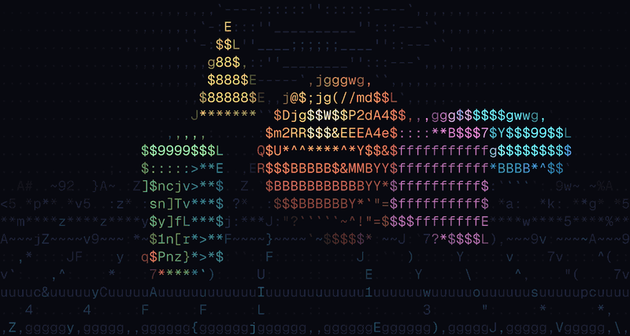

# ASCII FX

[](https://github.com/Amir-Abushanab/ascii-fx/actions/workflows/ci.yml)
[](https://www.npmjs.com/package/@ascii-fx/core)
[](https://bundlephobia.com/package/@ascii-fx/core)
[](./LICENSE)

Real-time ASCII rendering for the browser. Glyphs are chosen by shape rather than brightness, so the result keeps the edges and detail of the source.



**▶ [Open the playground](https://amir-abushanab.github.io/ascii-fx/)**

```tsx
import { AsciiImage } from '@ascii-fx/react'

;<AsciiImage src="/cat.jpg" alt="Cat" />
```

No configuration is required. The component compiles a font profile at runtime, renders with WebGPU where there's an adapter, and falls back to worker threads plus a WebGL2 draw where there isn't. If neither works, the plain `` underneath stays on screen.

## How it works

Most ASCII renderers map brightness to a character ramp: dark pixels become `.`, bright ones become `@`. That's one number per cell, so a diagonal edge and a flat grey with the same average brightness get the same glyph, and detail is lost.

ASCII FX matches on shape. Each glyph is rasterized to an 8×8 mask, each source cell is reduced to 8×8 samples, and the matcher picks the glyph whose mask best reconstructs the cell. Foreground and background colours are then fitted to the two regions that mask splits the cell into. A cell containing an edge gets a glyph with an edge in the same place.

|                          | brightness ramp | ASCII FX                       |
| ------------------------ | --------------- | ------------------------------ |
| input per cell           | 1 number        | 64 samples                     |
| picks glyph by           | luma            | 8×8 structural match           |
| colour                   | sampled average | fitted to the glyph's own mask |
| a `/` vs a flat mid-grey | identical       | distinguishable                |

The rerank is exact. With foreground and background free, the best colours for a mask are the means of its two sample sets, so the reconstruction error has a closed form and the winning glyph is the true minimum. [`ALGORITHM.md`](./ALGORITHM.md) specifies every constant, bit layout, and tie-break.

## Install

```sh
pnpm add @ascii-fx/react        # React: <AsciiImage> <AsciiVideo> <AsciiCanvas>
pnpm add @ascii-fx/gpu          # anywhere else: the renderer directly
```

Everything is ESM-only and side-effect free. `@ascii-fx/core` tree-shakes from 37 KB down to 289 bytes if all you import is `luma8`.

### React

```tsx
import { AsciiVideo } from '@ascii-fx/react'

;<AsciiVideo src="/clip.mp4" columns={160} color="full" autoPlay muted loop />
```

The server renders a normal `<video>` element as the fallback, and the client fades the canvas in over it once matching succeeds, with no layout shift. Components respect `prefers-reduced-motion`, pause when offscreen, and recover from GPU device loss on their own. See [`@ascii-fx/react`](./packages/react) for the hooks, error handling, and the `draw` hook for pixel effects.

### Anywhere else

```ts
import { createAsciiRenderer } from '@ascii-fx/gpu'

const ascii = await createAsciiRenderer({ canvas, profile })
ascii.setSource(video)
ascii.start()
```

`backend: 'auto'` uses WebGPU when there's an adapter and the CPU matcher when there isn't. The output is identical on both, bit for bit. The approximate matchers (`shape6`, `ramp`) are opt-in; the renderer never switches to one to hold a frame rate.

Without WebGPU, matching runs on a pool of workers and the grid is painted by a WebGL2 fullscreen draw, so the main thread only does the texture upload. Live sources pay one frame of latency for this. The first frame, static sources, and `captureFrame()` are matched inline. `workers: false` matches on the main thread instead, and `compositor: 'canvas2d'` paints with Canvas2D.

`temporal: true` skips cells whose 64 samples are byte-identical to the previous frame. The output is unchanged, since a cell depends only on its own samples. At 320×84, a frame where nothing moved matches in 8.9 ms instead of 125.7 ms. The WebGPU backend and the worker pool both honour it; the inline path always matches in full. Details in [`@ascii-fx/gpu`](./packages/gpu).

## Tilt

Interactions follow the pointer. A phone doesn't have one, so `tilt` drives the pointer from the orientation sensor instead:

```tsx
<AsciiImage src="/cat.jpg" alt="Cat" interaction={{ type: 'glyph-swell' }} tilt />
```

Tilting the phone moves the pointer in the direction of the tilt, corrected for screen orientation and relative to the angle the phone was held at when the component mounted. The pointer eases toward each new reading.

Tilt is disabled on iOS. Safari puts the sensor behind a permission dialog and nothing here opens one, so the component behaves as if `tilt` were off. To request permission, call `handle.enableTilt()` from a tap handler. Outside React, `@ascii-fx/gpu/tilt` exports `TiltSource` and `forwardTiltToPointer`. It's a separate subpath so the sensor code only loads when something uses it.

## Colour glyphs

Emoji carry their own colour, so there's nothing to fit and the exact rerank doesn't apply. `chromatic-v1` is a separate matcher for them. It compares a cell's 64 samples against the glyph's own, composited over the backdrop it will be drawn on.

```ts
const frame = matchFrame(source, { profile, matcher: 'chromatic', background: [11, 11, 15] })
// colorMode 'glyph': no colour planes, the colour is in the glyph
```

It has no flat path, polarity step, or prefilter. [`ALGORITHM.md §C`](./ALGORITHM.md) specifies it, and [`CHROMATIC-FINDINGS.md`](./CHROMATIC-FINDINGS.md) has the measurements behind each choice, including why the palette is curated to about 100 glyphs. Toggle Emoji mode in the playground to try it.

## Jitter

Taking the argmin means a cell whose top candidates score almost the same always resolves to the same one, so a wide region of similar content locks to a single glyph and reads as banding. On Geist Mono the shortlist is usually a near-tie: the best candidate scores 27 and the eighth-best 29. `jitter` lets each cell pick among the candidates that reconstruct it nearly as well, weighted toward the better ones.

```ts
const frame = matchFrame(source, { profile, jitter: 40 }) // 0 (default) = off, 255 = widest
```

The draw is seeded by a hash of the cell position, so results are reproducible and splitting a frame into bands doesn't change them. `jitterSeed` is constant by default; pass a frame counter to animate the dither. Only `@ascii-fx/core` implements it so far. [`ALGORITHM.md §20`](./ALGORITHM.md).

## Motion

Interactions normally follow the pointer. `source: 'motion'` drives them from the source's own movement instead:

```tsx
<AsciiVideo src="/clip.mp4" interaction={{ type: 'reveal', source: 'motion' }} />
```

Each cell's mean luma is compared with the previous frame, thresholded to ignore drift, passed through a square root so small movements still register, and decayed over time. A moving hand lights up in the shape of the hand and leaves a trail behind it. It's a per-cell field rather than a centroid, which matters on real footage: two people talking would average to a point in the empty space between them, and a camera pan would average to the centre of the frame.

The field is integer arithmetic end to end, so the WGSL and CPU implementations agree bit for bit, and `pnpm test:gpu` checks that. `wave`, `push` and `resolution` reject it: wave ignores the mask, and the other two need a single origin. [`ALGORITHM.md §21`](./ALGORITHM.md).

## Packages

| package                                           | what it owns                                                                      |
| ------------------------------------------------- | --------------------------------------------------------------------------------- |
| [`@ascii-fx/core`](./packages/core)               | the exact CPU matchers every backend is tested against, codecs, charsets, exports |
| [`@ascii-fx/gpu`](./packages/gpu)                 | WebGPU compute matching, one-draw compositor, interactions, worker/CPU fallback   |
| [`@ascii-fx/compiler`](./packages/compiler)       | deterministic font rasterization, atlases, `.asciip`/`.asciif`, CLI               |
| [`@ascii-fx/react`](./packages/react)             | `<AsciiImage>` `<AsciiVideo>` `<AsciiCanvas>` and hooks, SSR-safe                 |
| [`@ascii-fx/three`](./packages/three)             | `AsciiPass` for `WebGPURenderer`, instanced `AsciiGlyphs`                         |
| [`@ascii-fx/react-three`](./packages/react-three) | the same, as React Three Fiber components                                         |
| [`@ascii-fx/vite`](./packages/vite)               | build-time profiles and frames as typed virtual modules                           |

## Benchmarks

Published libraries, the same animated 1280×720 source, the same 160×42 grid where the library allows it, vsync off, each in an isolated page. Best of 2 passes, headless Chromium on an M3 Pro. Only the shape-aware rows pick glyphs by shape; the rest map brightness.

| approach                 | picks glyphs by              | p50 ms/frame | ~fps |
| ------------------------ | ---------------------------- | -----------: | ---: |
| ascii-fx, WebGPU         | shape + fitted color (exact) |          2.8 |  357 |
| ascii-fx, no WebGPU      | shape + fitted color (exact) |          2.8 |  357 |
| textmode.js 0.17 (WebGL) | brightness + color           |          4.5 |  222 |
| three.js AsciiEffect     | brightness                   |          8.2 |  122 |
| aalib.js 2.0, mono       | brightness                   |         10.3 |   97 |
| aalib.js 2.0, colored    | brightness + color           |         16.8 |   60 |
| chafa-wasm 0.3           | shape-aware blocks + fg/bg   |         50.1 |   20 |

The scene-only floor is 2.7 ms, so neither path adds measurable main-thread cost. Without a GPU the matcher runs on workers and the grid is painted by WebGL2. Removing those one at a time:

| fallback, by stage                   | p50 ms/frame | ~fps |
| ------------------------------------ | -----------: | ---: |
| matcher on the main thread, Canvas2D |         42.0 |   24 |
| matcher on workers, Canvas2D         |         31.9 |   31 |
| matcher on workers, WebGL2 composite |          2.8 |  357 |

The cells are identical in all three. Full tables and methodology: [`RESULTS.md`](./apps/benchmarks/RESULTS.md).

## Docs

- [`ALGORITHM.md`](./ALGORITHM.md), the normative spec: every constant, bit layout, and tie-break of `structural-v1`, `shape6-v1`, `ramp-v1`, `jitter-v1`, `motion-v1`, `chromatic-v1`, and the binary formats.
- [`ascii-fx-spec.md`](./ascii-fx-spec.md), the product spec this repo implements.
- [`RELEASING.md`](./RELEASING.md): changesets, the release workflow, and one-time npm and Pages setup.
- [`SECURITY.md`](./SECURITY.md): what counts as attack surface here, and how to report it.

## Development

```sh
pnpm install
pnpm dev              # playground at localhost:4321
pnpm check            # the full gate, also the pre-commit hook
```

```sh
pnpm build            # all packages (tsup, ESM + d.ts)
pnpm test             # node: unit, golden, oracle conformance, SSR
pnpm test:browser     # browser, no GPU needed
pnpm test:gpu         # browser, real adapter required: CPU/GPU bit-exact conformance
pnpm assets           # re-render the hero image and social card with the library itself
```

The GPU matcher has to agree with the CPU reference bit for bit: glyphs, colours, and flags, across colour modes, palettes, alpha modes, uneven reductions, temporal reuse, and dirty-region rematches. `pnpm test:gpu` checks this, and it needs a real adapter. GitHub runners report a software adapter that passes every availability check and then dies partway through the workload, so CI runs the GPU-free half and the pre-push hook runs the rest on any push that touches `packages/`. See [`RELEASING.md`](./RELEASING.md).

Other checks: `pnpm lint` (oxlint), `pnpm format` (oxfmt), `pnpm knip`, `pnpm depcruise`, and `pnpm package:check` (publint, are-the-types-wrong, and a tarball install into a throwaway npm project). Installs enforce a 7-day `minimumReleaseAge` on every dependency, transitive ones included.

`pnpm assets` renders the hero above and `assets/og.png` through the CPU matcher, so they always reflect the current output. `apps/docs/prep.mjs` copies the card into the site as its `og:image`. GitHub's repository social preview has no API, so that one is uploaded by hand under Settings → General.

## Prior art

Prior work this project draws on, all credited in [`ascii-fx-spec.md` §55](./ascii-fx-spec.md):

- Alex Harri, [_ASCII characters are not pixels: a deep dive into ASCII rendering_](https://alexharri.com/blog/ascii-rendering): the six-dimensional shape descriptor and directional contrast, implemented here as the opt-in `shape6` matcher.
- [chafa](https://hpjansson.org/chafa/) by Hans Petter Jansson: structural reconstruction against glyph masks, the family `structural-v1` belongs to.
- [arcade](https://github.com/vercel-labs/arcade) by Vercel: a CPU renderer for terminal games that samples among near-ties instead of always taking the best match, which keeps a scene from looking stencilled. `jitter-v1` is that idea in integer arithmetic.
- [mitos](https://github.com/oxidecomputer/mitos) by Oxide: an ASCII art tool that drives glyph density from a per-cell temporal delta with a decaying trail. There's no density ramp here, so `motion-v1` uses the same kind of field to drive interactions instead.

None of the code was ported. Each was reimplemented from its described behaviour and tested against this repo's CPU reference. `shape6` is benchmarked against the exact matcher in [`RESULTS.md`](./apps/benchmarks/RESULTS.md).

## Credits

Built by [Amir Abushanab](https://github.com/Amir-Abushanab). Font parsing via [fontkit](https://github.com/foliojs/fontkit); the site runs on [Astro](https://astro.build) and [Vite](https://vitejs.dev).

## License

[MIT](./LICENSE)
