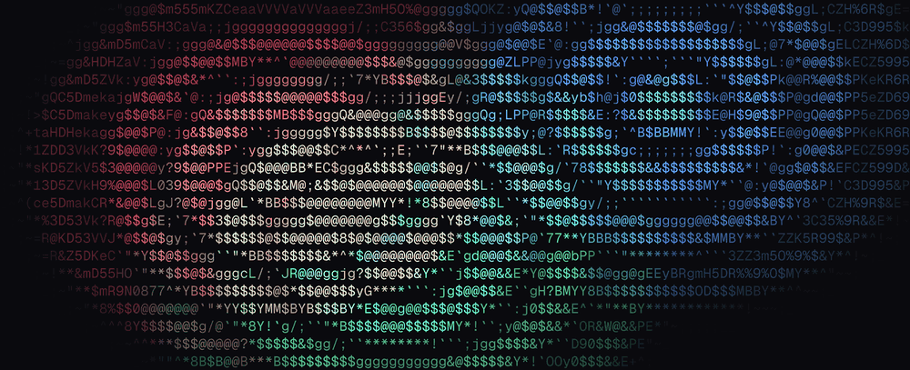

# ASCII FX

[](https://github.com/Amir-Abushanab/ascii-fx/actions/workflows/ci.yml)
[](https://www.npmjs.com/package/@ascii-fx/core)
[](https://bundlephobia.com/package/@ascii-fx/core)
[](./LICENSE)

Turn images and video into ASCII **that actually looks like the picture** — in real time, in the browser.



**▶ [Open the playground](https://amir-abushanab.github.io/ascii-fx/)**

```tsx
import { AsciiImage } from '@ascii-fx/react'

;<AsciiImage src="/cat.jpg" alt="Cat" />
```

That is the whole zero-config path. It picks a font, compiles a profile at runtime, renders on the GPU where there is one and the CPU where there isn't — and if none of that works, the plain `` underneath is still on screen.

## Shape, not brightness

Almost every ASCII renderer maps **brightness to a character ramp**: dark pixels get `.`, bright ones get `@`. That's one number per cell, so a diagonal edge and a flat grey of the same average brightness produce the same glyph. Detail dissolves.

ASCII FX matches on **shape**. Every glyph is rasterized to an 8×8 mask, every source cell is reduced to 8×8 samples, and the matcher asks which glyph's mask actually reconstructs this cell — then fits the ink and paper colours to the two halves that mask carves out. An edge stays an edge, because a glyph with an edge in the same place wins.

|                          | brightness ramp | ASCII FX                       |
| ------------------------ | --------------- | ------------------------------ |
| input per cell           | 1 number        | 64 samples                     |
| picks glyph by           | luma            | 8×8 structural match           |
| colour                   | sampled average | fitted to the glyph's own mask |
| a `/` vs a flat mid-grey | identical       | distinguishable                |

The rerank is **exact**, not a heuristic: with foreground and background free, the best colours for a given mask are the means of its two sample sets, so the reconstruction error has a closed form and the winner is the true minimum. [`ALGORITHM.md`](./ALGORITHM.md) is normative — every constant, bit layout, and tie-break.

## Install

```sh
pnpm add @ascii-fx/react        # React: <AsciiImage> <AsciiVideo> <AsciiCanvas>
pnpm add @ascii-fx/gpu          # anywhere else: the renderer directly
```

Everything is ESM-only and side-effect free, so importing one export pulls one export — `@ascii-fx/core` shakes from 37 KB down to **289 bytes** if all you want is `luma8`.

### React

```tsx
import { AsciiVideo } from '@ascii-fx/react'

;<AsciiVideo src="/clip.mp4" columns={160} color="full" autoPlay muted loop />
```

Server-renders the real `<video>` as a layout-stable, accessible fallback, then swaps in the canvas on the client with no flash and no layout shift. Honors `prefers-reduced-motion`, pauses offscreen, and recovers from GPU device loss on its own.

### Anywhere else

```ts
import { createAsciiRenderer } from '@ascii-fx/gpu'

const ascii = await createAsciiRenderer({ canvas, profile })
ascii.setSource(video)
ascii.start()
```

`backend: 'auto'` picks WebGPU when it's there and the CPU matcher when it isn't — and the CPU path is **bit-identical**, not an approximation. It never quietly downgrades you to a worse matcher to hold a frame rate; approximate matchers exist, but only if you ask for one by name.

## Colour glyphs

Emoji carry their own colour, which removes the move the main matcher is built on: with a free foreground and background, the best colours for a mask are the means of its two sample sets, and that is exactly what makes the rerank exact. Baked colour leaves nothing to fit — so `chromatic-v1` is a **separate algorithm**, comparing a cell's 64 samples against the glyph's own, composited over the backdrop it will be drawn on.

```ts
const frame = matchFrame(source, { profile, matcher: 'chromatic', background: [11, 11, 15] })
// colorMode 'glyph' — no colour planes, because the colour is in the glyph
```

No flat path, no polarity, no prefilter. [`ALGORITHM.md §C`](./ALGORITHM.md) is normative; the measurements behind each choice — including why the palette is curated to ~100 glyphs, and why a prefilter cost more quality than it saved time — are in [`CHROMATIC-FINDINGS.md`](./CHROMATIC-FINDINGS.md). Flip **Emoji mode** in the playground to drive it.

## Packages

| package                                           | what it owns                                                                            |
| ------------------------------------------------- | --------------------------------------------------------------------------------------- |
| [`@ascii-fx/core`](./packages/core)               | the exact CPU matchers (the oracle every backend is held to), codecs, charsets, exports |
| [`@ascii-fx/gpu`](./packages/gpu)                 | WebGPU compute matching, one-draw compositor, interactions, exact CPU fallback          |
| [`@ascii-fx/compiler`](./packages/compiler)       | deterministic font rasterization, atlases, `.asciip`/`.asciif`, CLI                     |
| [`@ascii-fx/react`](./packages/react)             | `<AsciiImage>` `<AsciiVideo>` `<AsciiCanvas>` + hooks, SSR-safe                         |
| [`@ascii-fx/three`](./packages/three)             | `AsciiPass` for `WebGPURenderer`, instanced `AsciiGlyphs`                               |
| [`@ascii-fx/react-three`](./packages/react-three) | the same, as React Three Fiber components                                               |
| [`@ascii-fx/vite`](./packages/vite)               | build-time profiles and frames as typed virtual modules                                 |

## How fast

Real published libraries, identical animated 1280×720 source, same 160×42 glyph grid where each library allows it, vsync off, each row in an isolated page (best of 2 passes, headless Chromium on an M3 Pro). Only the shape-aware rows pick glyphs by shape; the rest map brightness.

| approach                 | picks glyphs by                  | p50 ms/frame |    ~fps |
| ------------------------ | -------------------------------- | -----------: | ------: |
| **ascii-fx · WebGPU**    | **shape + fitted color (exact)** |      **2.8** | **357** |
| textmode.js 0.17 (WebGL) | brightness + color               |          3.7 |     270 |
| three.js AsciiEffect     | brightness                       |          6.0 |     167 |
| aalib.js 2.0 · mono      | brightness                       |          9.1 |     110 |
| aalib.js 2.0 · colored   | brightness + color               |         14.7 |      68 |
| ascii-fx · CPU fallback  | shape + fitted color (exact)     |         39.8 |      25 |
| chafa-wasm 0.3           | shape-aware blocks + fg/bg       |         47.1 |      21 |

The scene-only floor is 2.6 ms, so the WebGPU path costs the main thread ~0.2 ms — matching and compositing overlap on the GPU. Full table, methodology, and regeneration: [`RESULTS.md`](./apps/benchmarks/RESULTS.md).

## Documents

- [`ALGORITHM.md`](./ALGORITHM.md) — **normative**: every constant, bit layout, and tie-break of `structural-v1`, the binary formats, `shape6-v1`/`ramp-v1`.
- [`ascii-fx-spec.md`](./ascii-fx-spec.md) — the product spec this repo implements.
- [`RELEASING.md`](./RELEASING.md) — changesets, the release workflow, and the one-time npm/Pages setup.
- [`SECURITY.md`](./SECURITY.md) — what is actually attack surface here, and how to report it.

## Develop

```sh
pnpm install
pnpm dev              # the playground at localhost:4321
pnpm check            # the full gate — also the pre-commit hook
```

```sh
pnpm build            # all packages (tsup, ESM + d.ts)
pnpm test             # node suite: unit, golden, oracle-conformance, SSR
pnpm test:browser     # browser suite, no GPU needed
pnpm test:gpu         # browser suite, real adapter required: CPU↔GPU bit-exact conformance
pnpm assets           # re-render this README's hero with the library itself
```

**Exactness is the contract.** The GPU matcher must agree with the CPU reference bit-for-bit — glyphs, colours, flags — across colour modes, palettes, alpha modes, uneven reductions, temporal reuse, and dirty-region rematches. `pnpm test:gpu` is what proves it, and it needs a real adapter: a GitHub runner reports a _software_ adapter that passes every availability check and then dies partway through the workload, so CI runs the GPU-free half and the conformance suite is a pre-release gate ([`RELEASING.md`](./RELEASING.md)).

Hygiene: `pnpm lint` (oxlint), `pnpm format` (oxfmt), `pnpm knip`, `pnpm depcruise`, and `pnpm package:check` (publint + are-the-types-wrong + a real tarball install in a throwaway npm project). Dependencies are held to a 7-day `minimumReleaseAge` at install, transitive ones included.

The hero above is generated by `pnpm assets`, which renders a procedural scene through the actual CPU matcher — so it cannot drift from what the library does.

## Prior art

Two shape-aware approaches this project learned from, both credited in [`ascii-fx-spec.md` §55](./ascii-fx-spec.md):

- Alex Harri, [_ASCII characters are not pixels: a deep dive into ASCII rendering_](https://alexharri.com/blog/ascii-rendering) — the six-dimensional shape descriptor and directional contrast. Implemented here as the opt-in `shape6` matcher, never as a silent fallback.
- [chafa](https://hpjansson.org/chafa/) by Hans Petter Jansson — structural reconstruction against glyph masks, the family the default `structural-v1` matcher belongs to.

Both were implemented from their described behaviour and tested against this repo's own CPU reference, not ported. `shape6` is benched against the exact matcher in [`RESULTS.md`](./apps/benchmarks/RESULTS.md).

## Credits

Built by [Amir Abushanab](https://github.com/Amir-Abushanab). Font parsing via [fontkit](https://github.com/foliojs/fontkit); the site runs on [Astro](https://astro.build) and [Vite](https://vitejs.dev).

## License

[MIT](./LICENSE)
